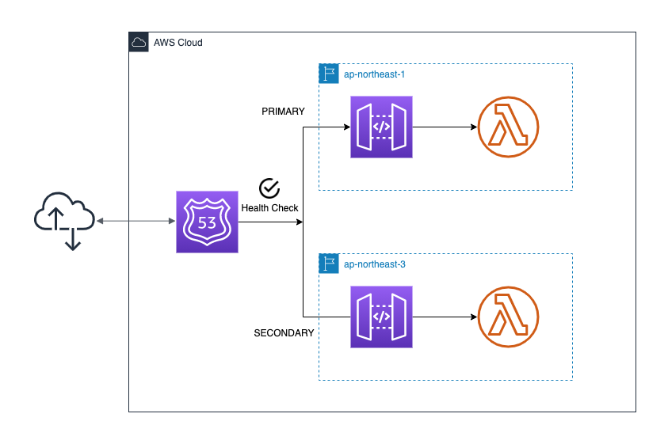

# Failover routing with serverless stack

This is example for creating stacks of failover rouging.


## Directory Structure

```
packages
 ├── backend // simple lambda function
 └── cdk // cdk stacks
```

## Stacks and Architecture
- api-gateway
- lambda
- route53
- certificatemanager



## Features
- Basically lambda on `ap-northeast-1` return a response when calling the api
- Once some errors are occured on `ap-northeast-1`, lambda on `ap-northeast-3` will return a response.

## Getting Started
```shell
$ cd packages/cdk
$ yarn
# Need to prepare some configures on `packages/cdk/lib/config.ts` before you run the script below
$ yarn run cdk deploy '*' 
# if you want to deploy all stacks at once, 
# otherwise you need to deploy a stack one by one
```

## How to reproduce failover and what stacks behave
- Return error code or just throw error on `packages/backend/src/tokyo.js` (Fixing the code on AWS console is easy)
- HealthCheck on route53 will show failing status
- 30~60 seconds later, the api will return a response from `packages/backend/src/osaka.js`
- `packages/backend/src/osaka.js` will return it unless `packages/backend/src/tokyo.js` return successful response
